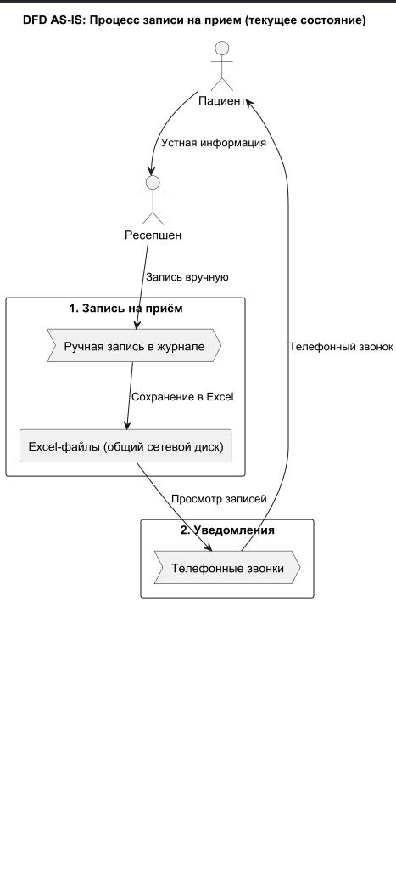
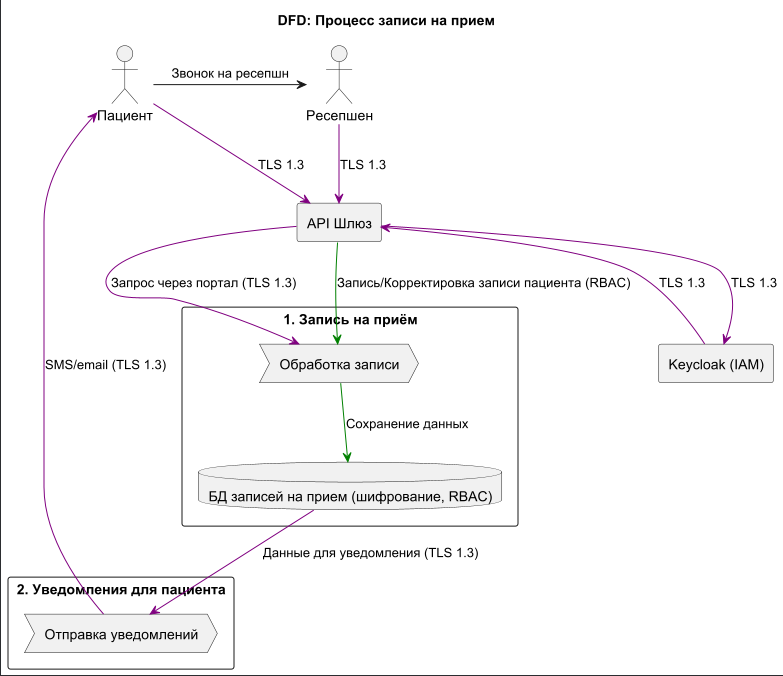
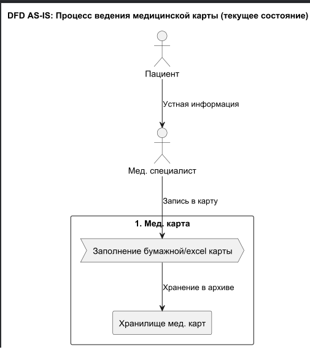
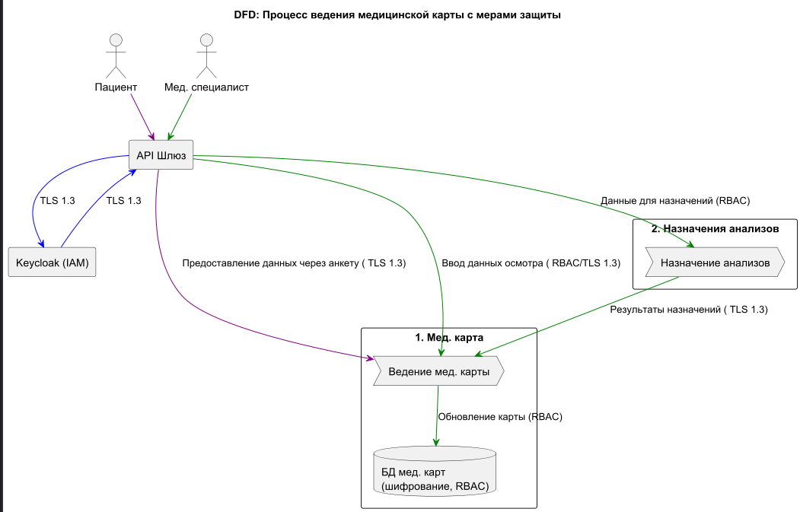
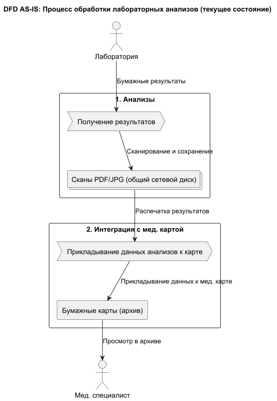
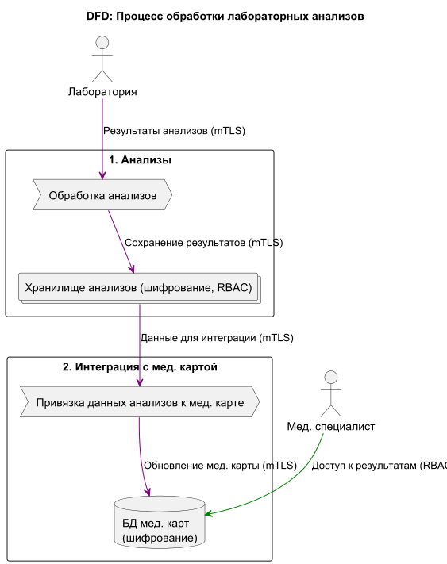
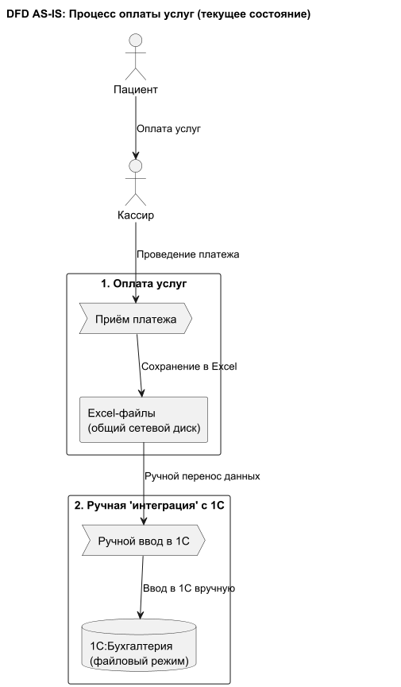
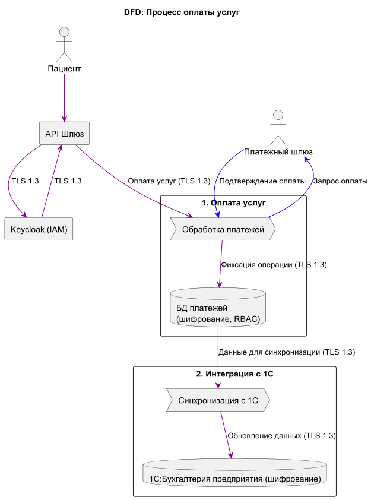
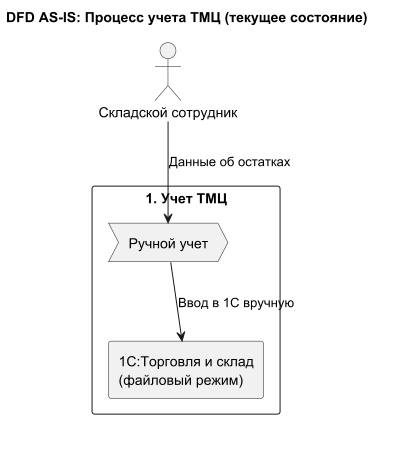
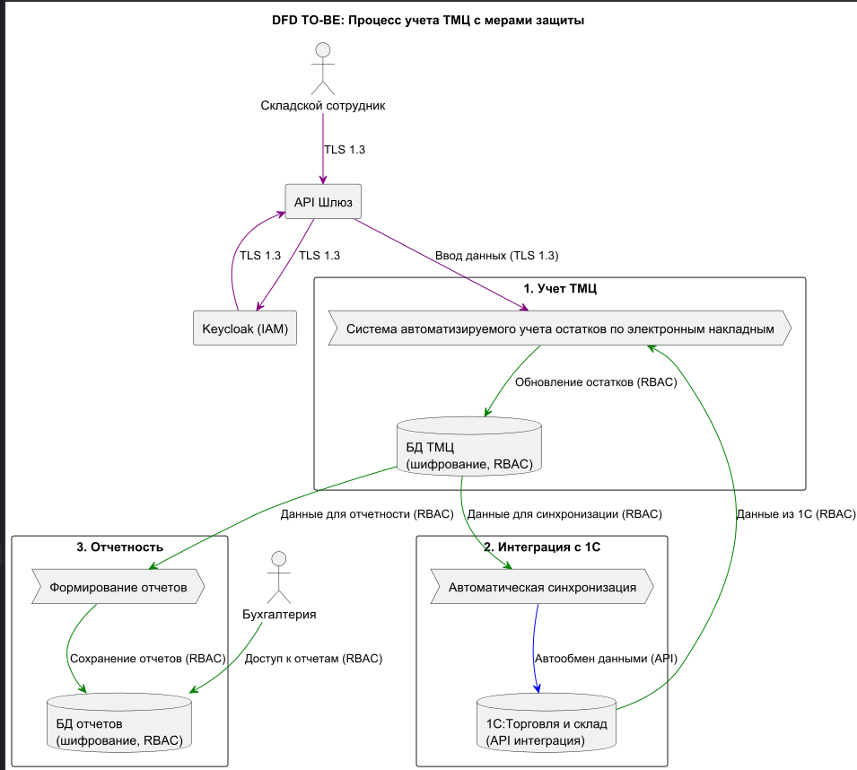

# Выявленные конфиденциальные данные и проблемные зоны текущего состояния

## Выявленные конфиденциальные данные, не учтённые надлежащим образом:

1. **Персональные данные (PII):** ФИО, дата рождения, паспортные данные, адрес прописки, телефон, email.
2. **Специальные категории персональных данных:** Информация о состоянии здоровья, хронических заболеваниях, результатах осмотров и анализов. Эти данные относятся к категории повышенной конфиденциальности.
3. **Финансовые данные:** Реквизиты договоров, история платежей.

---

## Проблемные зоны текущего состояния в организации:

1. **Отсутствие централизованного хранилища:** Данные разрознены по Excel-файлам, сканам и нескольким изолированным 1С.
2. **Отсутствие контроля доступа:** Нет разграничения прав (RBAC). Любой сотрудник в домене потенциально имеет доступ ко всем данным на общем диске.
3. **Отсутствие аудита:** Невозможно отследить, кто, когда и с какой целью accessed или изменил данные пациента.
4. **Небезопасные каналы передачи данных:** Обмен данными происходит по незашифрованным каналам (общие сетевые диски, OLE).
5. **Принцип "Data Minimization" не соблюдается:** Сотрудники имеют доступ ко всем данным сразу, а не к минимуму, необходимому для выполнения задачи.
6. **Уязвимость к утечкам:** Данные хранятся в открытом виде (Excel, JPG, PDF). Их легко скопировать на USB-накопитель или отправить по почте.
7. **Несоответствие 152-ФЗ:** Требования закона о защите ПДн (в частности, обработка специальных категорий данных) не выполняются в полной мере.

---

# Преобразование процессов: AS-IS → TO-BE

В рамках анализа и автоматизации процессов компании «Медикаменте» были построены диаграммы потоков данных (DFD) для каждого ключевого бизнес-процесса.
Для каждого процесса представлены две схемы: текущее состояние (AS-IS) и целевое состояние (TO-BE) после внедрения автоматизации и усиления мер безопасности

## Процесс 1: Запись на прием

**AS-IS:**  

**TO-BE:**  

---

## Процесс 2: Процесс ведения медицинской карты

**AS-IS:**  

**TO-BE:**  

---

## Процесс 3: Процесс обработки лабораторных анализов

**AS-IS:**  

**TO-BE:**  

---

## Процесс 4: Процесс оплаты услуг

**AS-IS:**  

**TO-BE:**  

---

## Процесс 5: Управление складом

**AS-IS:**  

**TO-BE:**  

---

Детальное описание категорий данных, способов их защиты и механизмов тегирования приведено ниже.

# Список данных для защиты и способы их защиты

| Категория данных                                   | Примеры данных                                                                | Способы защиты                                                                                | Теги данных                               |
| -------------------------------------------------- | ----------------------------------------------------------------------------- | --------------------------------------------------------------------------------------------- | ----------------------------------------- |
| **Персональные данные (PII)**                      | ФИО, телефон, email, дата рождения, паспортные данные, адрес прописки         | Шифрование (AES-256), Маскирование (XX XXX XXX), RBAC контроль доступа                        | `PD_PERSONAL`, `confidentiality:high`     |
| **Специальные категории ПДн (Медицинские данные)** | Диагнозы, история болезней, результаты анализов и осмотров, назначения врачей | Строгое шифрование (AES-256), Дифференциальная приватность для аналитики, Need-to-know доступ | `MED_SENSITIVE`, `confidentiality:high`   |
| **Финансовые данные**                              | Реквизиты договоров, суммы платежей, банковские реквизиты, история транзакций | Токенизация, Шифрование, Не хранить реквизиты карт (использовать токены платежных шлюзов)     | `FIN_PRIVATE`, `confidentiality:high`     |
| **Учетные данные**                                 | Логины, пароли, токены доступа, сертификаты                                   | Хеширование с солью (bcrypt), Хранение в защищенных хранилищах (Vault), Регулярная ротация    | `CREDENTIALS`, `confidentiality:critical` |
| **Служебные данные**                               | Внутренние отчеты, логи систем, метрики мониторинга                           | Обезличивание (удаление PII), Шифрование, RBAC контроль доступа                               | `INTERNAL`, `confidentiality:medium`      |
| **Метаданные операций**                            | Время запросов, IP-адреса, User-Agent, поведенческие паттерны                 | Псевдонимизация, Агрегация, Ограничение периода хранения                                      | `METADATA`, `confidentiality:low`         |

## Ключ к способам защиты:

- **Шифрование**: Преобразование данных в зашифрованный вид с использованием криптографических алгоритмов (AES-256)
- **Маскирование**: Частичное скрытие данных при отображении (например, XX XXX XXX для номера паспорта)
- **Токенизация**: Замена конфиденциальных данных на необратимые токены
- **Обезличивание**: Удаление или изменение идентифицирующей информации
- **Псевдонимизация**: Замена идентифицирующих данных на псевдонимы
- **RBAC**: Контроль доступа на основе ролей (Role-Based Access Control)
- **Need-to-know**: Принцип предоставления минимально необходимого доступа

## Механизм тегирования данных:

1. **Инструменты тегирования**: Apache Atlas, HashiCorp Vault, встроенные механизмы СУБД
2. **Способ реализации**:
   - Автоматическое тегирование на уровне приложения при создании данных
   - Добавление столбца `data_tags` в таблицы БД
   - Использование метаданных в объектных хранилищах
3. **Использование тегов**:
   - Применение политик безопасности на основе тегов
   - Мониторинг доступа к данным с определенными тегами
   - Автоматическое шифрование данных с тегами `confidentiality:high`
