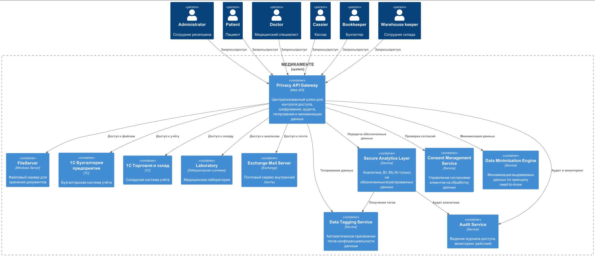

# Анализ рисков конфиденциальности (Privacy by Design)

## Состояние As-Is

- Данные хранятся в Excel, сканах, 1С, без централизованного контроля.
- Нет разграничения доступа, отсутствует аудит, данные доступны всем сотрудникам.
- Нет механизмов минимизации, шифрования, согласия на обработку, тегирования.

## Требования To-Be

- Централизованный контроль доступа и аудит.
- Минимизация выдаваемых данных (need-to-know).
- Тегирование и классификация данных по уровню конфиденциальности.
- Управление согласиями на обработку данных.
- Шифрование, маскирование, токенизация.
- Аналитика только на обезличенных/агрегированных данных.

## Механизмы управления рисками

1. **Privacy API Gateway**  
   Централизованный шлюз, через который проходят все обращения к данным. Реализует:

   - Аутентификацию и авторизацию (RBAC/ABAC)
   - Аудит доступа и действий
   - Шифрование, маскирование, токенизацию
   - Тегирование и классификацию данных
   - Минимизацию выдаваемых данных

2. **Data Tagging Service**  
   Автоматически присваивает тег конфиденциальности каждому объекту данных, интегрируется с Privacy API Gateway.

3. **Audit Service**  
   Ведёт журнал доступа, отслеживает нетипичные действия, интегрируется с системой алертинга.

4. **Consent Management Service**  
   Управляет согласиями клиентов на обработку данных, хранит историю изменений согласий.

5. **Data Minimization Engine**  
   Гарантирует, что пользователи и сервисы получают только минимально необходимый набор данных.

6. **Secure Analytics Layer**  
   Специализированный слой для аналитики, BI, ML/AI, который работает только с обезличенными, агрегированными или псевдонимизированными данными.

## Отдельнаяя схема с новыми блоками в архитектуре проектируемой системы

