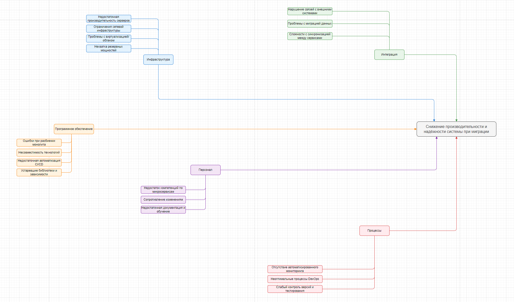

# Анализ рисков миграции

## Ключевые процессы и компоненты, затрагиваемые миграцией

- Базы данных (миграция схем, данных, обеспечение целостности)
- Коммуникационные каналы (API, межсервисные взаимодействия)
- Серверное оборудование (апгрейд, виртуализация, облако)
- Бизнес-логика (разделение на сервисы, рефакторинг)
- Интеграции с системами (1С, лаборатории, Платежный шлюз)
- Безопасность и контроль доступа
- Персонал (обучение)
- Процессы сопровождения, аудита и мониторинга

---

## Диаграмма Исикавы

**Категории и возможные проблемы:**

### 1. Инфраструктура

- Недостаточная производительность серверов
- Ограничения сетевой инфраструктуры
- Проблемы с виртуализацией/облаком
- Нехватка резервных мощностей

### 2. Программное обеспечение

- Ошибки при разбиении монолита
- Несовместимость технологий
- Недостаточная автоматизация CI/CD
- Устаревшие библиотеки и зависимости

### 3. Интеграция

- Нарушение связей с внешними системами (1С, лаборатории)
- Проблемы с миграцией данных
- Сложности с синхронизацией между сервисами

### 4. Персонал

- Недостаток компетенций по микросервисам
- Сопротивление изменениям
- Недостаточная документация и обучение

### 5. Процессы

- Отсутствие автоматизированного мониторинга
- Неоптимальные процессы DevOps
- Слабый контроль версий и тестирования

---

## Рекомендации по устранению узких мест

| Мера                                      | Категория      | Приоритет |
| ----------------------------------------- | -------------- | --------- |
| Апгрейд серверного оборудования           | Инфраструктура | Высокий   |
| Внедрение облачных решений                | Инфраструктура | Средний   |
| Разработка и внедрение CI/CD              | ПО/Процессы    | Высокий   |
| Обеспечение совместимости API             | Интеграция     | Высокий   |
| Проведение обучения персонала             | Персонал       | Высокий   |
| Внедрение автоматизированного мониторинга | Процессы       | Высокий   |
| Проведение аудита безопасности            | Безопасность   | Высокий   |
| Документирование архитектуры и процессов  | Все            | Средний   |

---

## Итого

- Проведён анализ ключевых компонентов и процессов, затрагиваемых миграцией.
- Построена диаграмма Исикавы для системного выявления причин узких мест.
- Предложены меры по устранению рисков, расставлены приоритеты.
- Рекомендуется реализовать поэтапную миграцию с постоянным мониторингом, обучением персонала и автоматизацией процессов.

---
